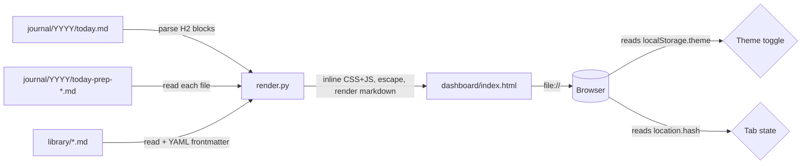

# Lightweight Dashboard for Paperwork-Generated Systems

## Enhancement Summary

**Deepened on:** 2026-05-15
**Sections enhanced:** 9 (Overview, Solution, Architecture, Data Flow, Markdown, Theming, Tabs, Library, Acceptance, PAPERWORK.md changes)
**Reviewers consulted:** best-practices-researcher, security-sentinel, code-simplicity-reviewer, kieran-python-reviewer, architecture-strategist, performance-oracle, agent-native-reviewer, design-iterator, spec-flow-analyzer

### Key Improvements
1. **Security hardening (P0):** URL scheme allowlist on `[text](url)` to block `javascript:`/`data:`/`vbscript:`, and a strict CSP meta tag for `file://` origin safety. The shareable-by-design HTML file + `file://`-same-origin behavior makes any XSS bug a credential-exfil bug — both fixes ship in v1.
2. **Three flow blockers resolved:**
   - `/sod` template gets a pinned text change (specific replacement, not "update step ~5") that emits a `## Schedule` H2 block, so the Schedule section actually has clean source instead of always falling through to "show full SOD."
   - `has_library` and `has_daily_bookends` flags from the interview now propagate into the renderer via the existing `{{dashboard_sections_list}}` / `{{dashboard_tabs_list}}` Mustache mechanism. Users who opted out of library don't see a "Library" tab telling them to create one; users without daily bookends don't see "Run /eod" empty states pointing at a command they don't have.
3. **Architecture for tomorrow's tabs:** introduce a `TABS` registry dict and thread a `target_date` parameter through section functions now — both are zero-behavior-change in v1 and free v2 from signature/structural migrations when health/velocity/weekly tabs land.
4. **Agent-native source split:** CSS and JS move to `dashboard/_assets/style.css` and `dashboard/_assets/app.js`, read by `render.py` via `importlib.resources` and inlined into the output. Generated `index.html` stays self-contained; the *source files* Claude restyles are real CSS/JS, not multi-line Python string constants.
5. **Module split + `__future__ annotations`:** `render.py` (~150 LOC, orchestration + HTML) + `_markdown.py` (~80 LOC, parser + renderer). `from __future__ import annotations` on every module so `dict[str, str]` etc. don't crash on Python 3.9 (Ubuntu 20.04 LTS still ships it).
6. **Section order, palette, and hero made editorial:** sections reordered chronologically to **Start of Day → Schedule → Meeting Prep → End of Day**. Palette swings from indigo-on-white (reads as Tailwind default) to warm neutral + ink-blue accent. Eyebrow + headline pattern under a single hairline rule. 96px between sections — the actual difference between "designed" and "unstyled."
7. **Theme toggle simplified to two-state.** System sets the initial paint; `localStorage.theme` is `light`, `dark`, or absent (= follow system). Cuts the third state without losing the system-aware behavior.
8. **Markdown renderer hardened:** escape-before-parse, fenced code extracted first with `\x00FENCED0\x00` placeholders (not `{{FENCE}}` — a journal could legitimately contain that), URL scheme allowlist on link rendering, fenced-code-aware H2 splitter so `## not a heading` inside ``` ``` ``` doesn't tear blocks apart.
9. **Acceptance criteria recalibrated:** dropped theatrical targets (50KB ceiling, W3C validator, 30-day < 1s) in favor of the only one that matters — "a new manager opens it and doesn't ask to redesign." Smoke test reduced from "test_render.py" to a fixtures-based golden-file snapshot + doctest on the markdown converter.

### New Considerations Discovered
- **`file://` is same-origin in Firefox / historic Safari** — a stored XSS in a library doc can `fetch('file:///~/.ssh/id_rsa')`. CSP closes most of this in ~3 lines of HTML.
- **Filename-derived data is attacker-controllable** — `library/.md` would land its name in HTML. Filename allowlist regex required.
- **Browser-local state (theme choice, tab hash, `<details>` open) is invisible to Claude.** Acceptable for cosmetic state, but documented in `dashboard/README.md` as a boundary: never store decisions there.
- **The /sod template doesn't currently emit any structured schedule block** — pinning the exact diff prevents the renderer from shipping with a fallback path that triggers for every new user.
- **Existing PAPERWORK.md `{{dashboard_sections_list}}` mechanism (line ~786) was load-bearing** for conditional rendering and the original plan accidentally dropped it. Restored.

### Decisions Where Reviewers Disagreed
- **Cut the hand-rolled markdown renderer? (simplicity vs. design):** keep it. Design said "single biggest 'feels finished' lever" is editorial typography on rendered content; that requires real HTML, not styled `<pre>`. Simplicity's cut would meet the "doesn't crash" bar but not the "doesn't feel like a debug page" bar.
- **Drop the Library tab from MVP? (design + simplicity vs. user request):** keep it. The user explicitly asked for it ("Maybe there's a library tab and then a daily tab"). But adopt the simplicity cut on Library *internals* — flat card grid with click-to-toggle inline expansion, no slide-over panel, no captured-date sort fallback, no tags-as-filters.
- **Three-state theme toggle? (best-practices vs. simplicity):** simplify to two-state (Light/Dark) with system as initial default. System mode is *the default state* of the toggle (no `localStorage.theme` key), not a separately re-selectable state.
- **CSS-in-Python vs. separate source files (original plan vs. agent-native reviewer):** split. The agent-restylability argument is decisive.

---

## Overview

Paperwork's setup interview offers an optional visual dashboard. The current template in `PAPERWORK.md` Step 9 produces a bare bones renderer that dumps escaped markdown into `<pre>` blocks. It works but doesn't feel "clean, simple, modern, and professional" — and it doesn't surface the four artifacts managers actually want side-by-side: today's schedule, generated prep docs, start-of-day output, and end-of-day output. It also has no notion of a reusable Library tab for accumulated reference material.

This plan replaces Step 9's dashboard template with a single-file, self-contained HTML dashboard, generated locally by `python dashboard/render.py`, with two tabs (**Daily** and **Library**), system-aware light/dark mode plus manual toggle, and a neutral professional design language that doesn't impose Jamie's personal brand on new users.

## Problem Statement / Motivation

The Paperwork setup script is designed to bootstrap a *second brain* for managers and leaders running small to large teams. The agent-driven layer (CLAUDE.md, slash commands, question banks, signal framework) is in good shape. The visible surface — the dashboard a new user sees when they open `index.html` in their browser — is the weakest part of the generated system right now:

1. **Visual:** the current template ships ~15 lines of utilitarian CSS. It renders every section as escaped `<pre>`. First impression for a new user is "this looks like a debug page," not "this is my command center."
2. **Information architecture:** schedule, prep, SOD recap, and EOD recap are all crammed into one stack with no priority. There's nowhere for accumulated reference material (1:1 templates, principles docs, research briefs, post-mortems) to live, even though Paperwork-generated repos accumulate that content naturally over weeks of use.
3. **Personal vs. generic gap:** Jamie's personal `paperwork` repo has a much richer dashboard (Verge-inspired palette, Space Grotesk/DM Mono fonts, week-strip nav, color-coded meeting cards). It's beautiful but extremely customized — wrong starting point for a stranger who's just run setup. The lightweight version needs to be inspired by that work without inheriting the brand.
4. **No theme switching:** modern table stakes. Many managers work into the evening; auto dark mode + manual toggle is expected, not a bonus.

What we want: a dashboard a new user opens and immediately thinks "this is mine, I can build on this," not "I need to throw this out and ask Claude to start over."

## Proposed Solution

Replace `PAPERWORK.md` Step 9's `dashboard/` templates with a redesigned generator that compiles separate source files into a single self-contained HTML output:

- **One script, one output.** `dashboard/render.py` reads journal and library files on disk plus sibling CSS/JS source files, and writes `dashboard/index.html`. No server, no build step, no external Python packages — stdlib only so it runs on any machine with Python 3.9+ (Mac/Linux/WSL).
- **Source split, output unified.** CSS lives in `dashboard/_assets/style.css` and JS lives in `dashboard/_assets/app.js`. The script reads them via `importlib.resources` and inlines them into the generated HTML. Agents (and humans) editing styles work in real CSS files with syntax highlighting; the shipped file is still one HTML to open.
- **Two tabs, JS-driven, opt-in.** Daily (default) and Library. Tab state in URL hash (`#daily` / `#library`) so a bookmark lands you on the right view. **Library tab only renders if the user opted in to it during setup** — `has_library=false` strips both the tab button and the panel. Daily tab is always present when the dashboard is generated.
- **Four sections on Daily, chronologically ordered, conditionally rendered.** **Start of Day → Schedule → Meeting Prep → End of Day**. Each section is registered through a conditional list driven by interview flags: `has_daily_bookends=false` strips the Start-of-Day and End-of-Day sections; the user is never shown "Run /eod" pointing at a command they don't have. Empty states for present-but-not-yet-run sections tell the user which command populates them.
- **Library tab = card grid with inline expansion.** One card per `library/**/*.md` file (recursive glob, flat display — preserves freedom to organize later without a migration). Cards show title + summary + captured date pulled from optional YAML frontmatter, with sensible fallbacks (filename humanized, first paragraph truncated to 140 chars, file mtime). Click a card → it expands inline with the rendered markdown below the grid. Click again or click an explicit Close link → collapses. No modal, no slide-over, no separate page.
- **System-aware theming, two-state override.** `prefers-color-scheme` media query sets the *initial* default (and the live default while no override is set). A toggle in the top-right writes `light` or `dark` to `localStorage.theme`; clearing the choice falls back to system. Toggle UX: a small segmented control showing `[System | Light | Dark]` where "System" is selected when no override exists, and the active option is visibly the current rendered state.
- **Restrained, warm, editorial design language.** System font stack (no Google Fonts dependency). Warm-neutral surfaces (`#fbfaf7` light, `#14130f` dark) instead of pure white/black. Single ink-blue accent (`#1f3a5f` light, `#c9d6e8` dark) instead of indigo — reads as "OS-native tool," not "Tailwind SaaS." Generous whitespace (96px between sections), single hairline rule under the editorial hero, no decorative emoji.
- **Editorial hero.** Eyebrow (`TODAY · FRIDAY, MAY 15`, uppercase, tracked +0.08em, muted) above a large headline (`Your day at a glance` or the date written out). Single hairline rule below. No lede paragraph — keeps it utility, not magazine.
- **Self-contained output file.** Generated `index.html` has inlined CSS and JS, system fonts, data-URI favicon. User can mail it, drop it on a USB stick, or commit it without external asset dependencies. A small `<small>Generated <time>YYYY-MM-DD HH:MM</time></small>` line in the footer closes the "did I re-run render?" staleness question.
- **CSP for `file://` safety.** Inline `<meta http-equiv="Content-Security-Policy">` blocks all network requests, all external scripts, and form submissions. Combined with the URL-scheme allowlist in the markdown renderer, neutralizes the realistic stored-XSS attack surface (calendar event titles, Linear ticket titles, library docs copy-pasted from email) without sacrificing the inline-everything model.
- **Hardened tiny markdown renderer.** Hand-rolled ~80-line module (`dashboard/_markdown.py`) handles ATX headings, paragraphs, bulleted/numbered lists with one level of nesting, bold/italic, inline code, fenced code blocks, blockquotes, links, horizontal rules. Three rules that aren't negotiable: (1) escape-then-parse order, (2) fenced code blocks extracted to `\x00FENCED{i}\x00` placeholders before any other pass, (3) link rendering passes URLs through a scheme allowlist (`http`, `https`, `mailto`, `#`, relative paths only — everything else becomes `#`). Unknown markdown degrades gracefully to literal escaped text.

## Technical Approach

### Architecture

```
[paperwork-generated repo]
├── dashboard/
│   ├── render.py           # CLI entry, orchestration, HTML composition (~150 LOC)
│   ├── _markdown.py        # render_markdown + split_into_h2_blocks (~80 LOC)
│   ├── _assets/
│   │   ├── style.css       # source CSS — agent edits this, render.py inlines it
│   │   └── app.js          # source JS — same
│   ├── README.md           # how to run, customize, extend; agent-state boundary doc
│   └── index.html          # generated output (gitignored by default)
├── journal/
│   └── [year]/
│       ├── [YYYY-MM-DD].md            ← contains ## SOD, ## Schedule, ## EOD, ## Think, etc.
│       └── [YYYY-MM-DD]-prep-*.md     ← one file per prep card
└── library/                            ← only if has_library=true
    └── **/*.md                         ← recursive glob, flat display
```

The dashboard is a **thin presentation layer.** It does not compute prep, recap, or schedule on its own. Slash commands write markdown to disk; `render.py` reads those files and renders them as HTML. This is the same invariant Jamie's personal dashboard preserves, and the one PAPERWORK.md already established in commit `a882260`.

Both Python modules start with `from __future__ import annotations` so `dict[str, str]`-style type hints work cleanly on Python 3.9+ (Ubuntu 20.04 LTS still ships Python 3.9 — bumping the floor to 3.10 would lock out a real audience).

**Single-source schema for journal H2 headings.** A module-level `JOURNAL_HEADINGS = {"sod": "SOD", "schedule": "Schedule", "eod": "EOD"}` constant in `render.py` is the contract between slash command templates and the renderer. PAPERWORK.md template comments for `/sod` and `/eod` reference these names so a future heading rename touches one file, not three.

### Tab + Section Registry

Replace the original plan's flat `SECTIONS = [...]` list with a tab registry, conditionally pruned at generation time based on interview flags. This is what the Mustache layer assembles inside Step 9 before `render.py` is written:

```python
# render.py — populated by PAPERWORK.md generation with interview flags
TABS = {
    "daily": [
        {"label": "Start of day",  "fn": sod_section,        "enabled": True},
        {"label": "Schedule",      "fn": schedule_section,   "enabled": True},
        {"label": "Meeting prep",  "fn": prep_cards_section, "enabled": True},
        {"label": "End of day",    "fn": eod_section,        "enabled": True},
    ],
    {{#if has_library}}
    "library": [
        {"label": "Library", "fn": library_section, "enabled": True},
    ],
    {{/if}}
}
```

When `has_daily_bookends=false`, the Mustache template generation flips the `enabled` flag on `sod_section` and `eod_section` (or omits them entirely). When `has_library=false`, the entire `"library"` key is omitted — the tab nav script reads `Object.keys(TABS)` to know which tabs to show, so a missing key means a missing tab automatically. Zero "conditional Library tab" branching in the HTML composer.

This is the architectural equivalent of the existing `{{dashboard_sections_list}}` placeholder in PAPERWORK.md line 786 — that mechanism is preserved, just reshaped to support multi-tab.

### `target_date` Threaded Through Section Functions

Every section function takes `(target_date: date) -> str`. v1 always calls them with `date.today()`, but v2's "view yesterday" feature requires nothing more than a query-string parser passing a different date in. Without this, every section function will need a signature migration when multi-day arrives.

```python
def sod_section(target_date: date) -> str: ...
def schedule_section(target_date: date) -> str: ...
def prep_cards_section(target_date: date) -> str: ...
def eod_section(target_date: date) -> str: ...
def library_section(target_date: date) -> str: ...   # accepts param, ignores it
```

### Data Flow

```
Morning:
  /sod          → appends ## SOD block to journal/[year]/[today].md
                  (briefing includes priorities + schedule)
  /sod          → invokes /prep for each calendar event
  /prep         → writes journal/[year]/[today]-prep-[slug].md per meeting
  python dashboard/render.py
                → reads today's journal + prep cards
                → writes dashboard/index.html
  Open index.html → Daily tab populated

Evening:
  /eod          → appends ## EOD block to journal/[year]/[today].md
  python dashboard/render.py
  Refresh browser → End-of-Day section populated
```

### File Reading Conventions

The generator looks for these files (paths relative to repo root, where `dashboard/` lives one level deep):

| Source | Path | Section consumed by |
|---|---|---|
| Today's journal | `journal/[year]/[today].md` | Schedule, Start of Day, End of Day (parsed by H2 heading) |
| Prep cards | `journal/[year]/[today]-prep-*.md` (explicit prefix — NOT `journal/*/*-prep-*.md`) | Meeting Prep (one collapsible per file, sorted by filename) |
| Library docs | `library/**/*.md` (recursive) | Library tab (one card per file, alphabetical by title) |

The journal file gets parsed into blocks by H2 headings via `_markdown.split_into_h2_blocks`. The generator pulls:

- `## Schedule` → Schedule section
- `## SOD` → Start of Day section
- `## EOD` → End of Day section
- Everything else (`## Think:`, `## Prune`, `## Thinking`) is ignored by the dashboard; users can extend the renderer if they want it.

**The `/sod` template gets a pinned text change in this PR** (see "PAPERWORK.md Changes" below) so that every newly-generated system writes a clean `## Schedule` block. Manual fallback path for old generated systems: if no `## Schedule` H2 exists in today's journal, the Schedule section renders the SOD block with a one-line note pointing the user at the `/sod` regeneration command — but no new system should ever hit this path.

**H2 splitter is fenced-code-aware.** `## not a heading` inside a triple-backtick code block must not split a journal. `split_into_h2_blocks` first masks fenced regions (same trick the markdown renderer uses) before scanning for H2 patterns.

**Prep glob is constrained to today's prefix** — `journal/{year}/{today.isoformat()}-prep-*.md`, not a recursive scan. At 6 months of journal entries (~120 files), this saves a directory walk and clarifies intent.

**Filename validation.** Before reading any prep card or library file, validate filename against `^[A-Za-z0-9._-]+\.md$`. Files that don't match are skipped with a console warning. Defense against names like `.md` ending up in HTML attributes.

**Path safety.** Resolve via `Path.resolve()` and assert the result stays under the expected directory. Defends against symlink escapes if someone restores a journal from a tarball.

**Per-file size cap.** Skip any single markdown file larger than 1 MB with a console warning. Defense against regex-DoS pathologies on adversarial content.

### Inline Markdown Renderer (`dashboard/_markdown.py`)

Implemented as a single function `render_markdown(text: str) -> str` in a sibling module. The order of operations is the entire security story; this is the spec:

```python
import html
import re
from urllib.parse import urlparse

SAFE_SCHEMES = {"http", "https", "mailto", ""}  # "" = relative paths
FENCE_RE = re.compile(r"```(?P<info>[\w-]{0,30})?\n(?P<body>.*?)\n```", re.DOTALL)

def _safe_href(url: str) -> str:
    """Allowlist URL schemes. Return '#' for anything else."""
    url = url.strip()
    if any(c in url for c in "\x00\x01\x02\x03\x04\x05\x06\x07\x08\x0b\x0c\x0e\x0f"):
        return "#"  # reject control chars used to defeat scheme matchers
    scheme = urlparse(url).scheme.lower()
    return url if scheme in SAFE_SCHEMES else "#"

def render_markdown(text: str) -> str:
    # 1. Extract fenced code blocks BEFORE escaping (so backticks survive).
    #    \x00 sentinels — NUL is forbidden in source markdown by our file
    #    reader so a placeholder collision is impossible.
    fenced: list[str] = []
    def stash(m: re.Match) -> str:
        info = (m.group("info") or "").strip()
        info = info if re.match(r"^[A-Za-z0-9_-]{0,30}$", info) else ""
        body = html.escape(m.group("body"), quote=False)
        cls = f' class="lang-{info}"' if info else ""
        fenced.append(f"<pre><code{cls}>{body}</code></pre>")
        return f"\x00FENCED{len(fenced)-1}\x00"
    text = FENCE_RE.sub(stash, text)

    # 2. Escape everything else (quote=False is fine for text nodes;
    #    attribute values use quote=True below).
    text = html.escape(text, quote=False)

    # 3. Inline rules (applied to already-escaped text):
    text = re.sub(r"`([^`\n]+)`", r"<code>\1</code>", text)
    text = re.sub(r"\*\*([^*\n]+)\*\*", r"<strong>\1</strong>", text)
    text = re.sub(r"(?<![*\w])\*([^*\n]+)\*(?!\w)", r"<em>\1</em>", text)
    text = re.sub(
        r"\[([^\]\n]{1,200})\]\(([^)\n\s]{1,500})\)",
        lambda m: f'<a href="{html.escape(_safe_href(m.group(2)), quote=True)}">{m.group(1)}</a>',
        text,
    )

    # 4. Block-level: a line-by-line state machine handles headings, lists
    #    (one level of nesting), blockquotes, horizontal rules, and
    #    paragraphs. State machine is required — pure regex on lists with
    #    nesting leads to catastrophic backtracking and wrong output.
    text = _block_render(text)

    # 5. Restore fenced code placeholders. Use str.replace per index
    #    (k is small, O(n·k) is fine in practice).
    for i, block in enumerate(fenced):
        text = text.replace(f"\x00FENCED{i}\x00", block)
    return text
```

**Why this is XSS-safe:**

- `<script>foo</script>` in any source position is escaped to `&lt;script&gt;` before any markdown rule fires.
- `[click](javascript:alert(1))` runs through `_safe_href` which strips it to `#`.
- `[click](java\tscript:alert(1))` is rejected by the control-char check.
- ``` ```javascript … ``` ``` info string is allowlist-validated before becoming `class="lang-javascript"`.
- Fenced code bodies are escaped before placeholder insertion so `<script>` inside a code block becomes `&lt;script&gt;`.
- The `\x00FENCED{i}\x00` placeholder cannot appear in user input because the file reader rejects NUL bytes.

**One-level list nesting** uses a state machine (not regex): track indent (0 vs. 2–4 spaces) per line; open nested `<ul>`/`<ol>` on indent increase, close on decrease. Tries to nest with pure regex have a long history of bugs and were not adopted.

**Doctest examples are the markdown spec.** Each rule has a one-line doctest in `_markdown.py`:

```python
def render_markdown(text: str) -> str:
    """
    >>> render_markdown("**bold**")
    '<p><strong>bold</strong></p>'
    >>> render_markdown("[ok](https://example.com)")
    '<p><a href="https://example.com">ok</a></p>'
    >>> render_markdown("[bad](javascript:alert(1))")
    '<p><a href="#">bad</a></p>'
    >>> render_markdown("`<script>`")
    '<p><code>&lt;script&gt;</code></p>'
    """
```

Run with `python -m doctest dashboard/_markdown.py -v`. Self-documenting, no test framework, breakage caught at first run.

**Why hand-rolled instead of `pip install markdown`:** Paperwork promises zero-install. The setup script already commits to "stdlib only." A ~80-line module covers 95% of what shows up in journal content, and the escape-then-parse discipline is harder to enforce on top of a third-party renderer with its own (historically broken) "safe mode."

**References:** WAI-ARIA APG and MDN for ARIA tab pattern (used in the tab implementation); OWASP XSS Prevention Cheat Sheet (escape-by-context); Python `html` stdlib docs.

### Theming

**Palette: warm neutral + ink-blue accent.** Indigo-on-white reads as 2020-Tailwind-default, which now codes as "AI-generated SaaS" in 2026. Warm neutrals + a single deep-ink accent reads as OS-native tool and stays generic across companies.

```css
/* Light mode (initial paint when no override and no system dark preference) */
:root {
  color-scheme: light dark;
  --bg: #fbfaf7;          /* warm off-white — 3% warm cast reads finished */
  --surface: #ffffff;
  --border: #e8e4dc;
  --text: #1a1a1a;
  --text-muted: #6b6258;
  --accent: #1f3a5f;      /* deep ink blue */
  --accent-soft: #eef1f6;
  --shadow: 0 1px 2px rgba(0, 0, 0, 0.04);
}

/* Dark mode — applied when:
   1. system prefers dark AND no user override, OR
   2. user explicitly chose dark (data-theme="dark") */
@media (prefers-color-scheme: dark) {
  :root:not([data-theme="light"]) {
    --bg: #14130f;        /* warm near-black */
    --surface: #1c1b17;
    --border: #2a2823;
    --text: #f5f3ee;
    --text-muted: #a59f93;
    --accent: #c9d6e8;
    --accent-soft: rgba(201, 214, 232, 0.10);
    --shadow: none;
  }
}
:root[data-theme="dark"] {
  --bg: #14130f;
  /* …same vars as media query above… */
}

body { background: var(--bg); color: var(--text); }
/* Critically: NO transition on body or :root. Theme flips must be instant —
   transitions cause a full-page flash that's a photosensitivity hazard. */
```

**Toggle is a three-button segmented control, not a cycling single button.** Per WAI-ARIA, three mutually-exclusive choices use `role="radiogroup"` with `role="radio"` children and `aria-checked` — not `aria-pressed`. Cycling buttons are a known anti-pattern for three states (users can't tell which mode is current without an external cue).

```html
<fieldset role="radiogroup" aria-label="Color theme">
  <button role="radio" aria-checked="true"  data-theme-choice="system">System</button>
  <button role="radio" aria-checked="false" data-theme-choice="light">Light</button>
  <button role="radio" aria-checked="false" data-theme-choice="dark">Dark</button>
</fieldset>
```

**Anti-flash script (FOUC prevention).** Inline `<script>` in `<head>` BEFORE the stylesheet (synchronous, no `defer`/`async`). Sets `data-theme` on `<html>` so CSS variables resolve before first paint:

```html
<head>
  <script>
    (function () {
      var stored = localStorage.getItem('theme'); // 'light' | 'dark' | null
      if (stored === 'light' || stored === 'dark') {
        document.documentElement.dataset.theme = stored;
      }
      // If no stored choice, leave dataset.theme unset; the @media query owns it.
      document.documentElement.style.colorScheme =
        stored || (matchMedia('(prefers-color-scheme: dark)').matches ? 'dark' : 'light');
    })();
  </script>
  <style>/* inlined dashboard CSS */</style>
</head>
```

Storage convention: `localStorage.removeItem('theme')` for "System" (absence = follow OS, not a stored "system" value). The toggle JS also subscribes to `matchMedia('(prefers-color-scheme: dark)').addEventListener('change', ...)` so when System is the active choice, the page reacts live to OS-level theme changes.

### Tab Switching (WAI-ARIA Tabs Pattern)

Per the WAI-ARIA Authoring Practices Guide. Roving tabindex (exactly one tab has `tabindex="0"`, others `-1`). Arrow keys navigate within the tablist; Tab key exits into the panel. Automatic activation on focus (panels are static — no expensive load to defer).

```html
<div role="tablist" aria-label="Sections">
  <button role="tab" id="tab-daily"   aria-controls="panel-daily"
          aria-selected="true"  tabindex="0">Daily</button>
  <button role="tab" id="tab-library" aria-controls="panel-library"
          aria-selected="false" tabindex="-1">Library</button>
</div>
<section role="tabpanel" id="panel-daily"   aria-labelledby="tab-daily"   tabindex="0">…</section>
<section role="tabpanel" id="panel-library" aria-labelledby="tab-library" tabindex="0" hidden>…</section>
```

```javascript
const VALID_TABS = new Set(['daily', 'library']);

function showTab(name) {
  if (!VALID_TABS.has(name)) name = 'daily';
  document.querySelectorAll('[role="tab"]').forEach(el => {
    const active = el.id === 'tab-' + name;
    el.setAttribute('aria-selected', active);
    el.tabIndex = active ? 0 : -1;
  });
  document.querySelectorAll('[role="tabpanel"]').forEach(el => {
    el.hidden = el.id !== 'panel-' + name;
  });
  if (location.hash !== '#' + name) history.replaceState(null, '', '#' + name);
}

// Keyboard: Left/Right arrows, Home, End — automatic activation on focus.
document.querySelectorAll('[role="tab"]').forEach((tab, _, all) => {
  tab.addEventListener('keydown', (e) => {
    const i = [...all].indexOf(tab);
    let next;
    if (e.key === 'ArrowLeft')  next = all[(i - 1 + all.length) % all.length];
    if (e.key === 'ArrowRight') next = all[(i + 1) % all.length];
    if (e.key === 'Home')       next = all[0];
    if (e.key === 'End')        next = all[all.length - 1];
    if (next) { next.focus(); showTab(next.id.replace('tab-', '')); e.preventDefault(); }
  });
  tab.addEventListener('click', () => showTab(tab.id.replace('tab-', '')));
});

window.addEventListener('hashchange', () => showTab(location.hash.slice(1)));
showTab(location.hash.slice(1) || 'daily');
```

`history.replaceState` instead of setting `location.hash` directly — avoids polluting browser history with every tab click.

`VALID_TABS` allowlist defends against `#<script>` etc. in the hash. Total JS payload (tabs + theme toggle + library card expansion): ~80 lines.

### Section Component Sketch

Each section renders to roughly this structure:

```html
<section class="panel">
  <div class="panel-head">
    <h2>Schedule</h2>
    <span class="panel-meta">3 events · today</span>
  </div>
  <div class="panel-body">
    <!-- rendered markdown or empty-state message -->
  </div>
</section>
```

Empty states use a hollow-circle glyph (`◌`, U+25CC — single Unicode char, muted) plus a short imperative plus a command in a styled chip. No illustrations (illustrations fight "neutral, professional" and date the dashboard immediately):

```html
<div class="empty">
  <span class="empty-glyph" aria-hidden="true">◌</span>
  <p class="empty-title">Nothing here yet.</p>
  <p class="empty-hint">Run <code class="cmd">/sod</code> in your terminal, then re-run <code>python dashboard/render.py</code>.</p>
</div>
```

Section spacing: **96px between panels.** This is the single biggest "designed vs. unstyled" lever; tighter spacing reads as a debug stack. Daily panel max-width 760px (single-column reading width); Library card grid max-width 1100px (the grid breathes).

Meeting Prep section uses one `<details>` element per prep card so they collapse independently. End of Day is collapsed-by-default; clicking expands.

Counts in panel meta (`3 events · today`) are always built via `%d` formatting on integers, never via string concatenation from journal content. Defense against injected count strings.

### Library Tab

Only generated when `has_library=true` (interview flag). Otherwise the tab nav button and the `panel-library` section are both absent — `Object.keys(TABS)` returns just `['daily']` and the tab nav renders accordingly.

```html
<div role="tabpanel" id="panel-library" aria-labelledby="tab-library" tabindex="0" hidden>
  <header class="hero">
    <p class="eyebrow">LIBRARY · 12 DOCS</p>
    <h1>Reference shelf</h1>
  </header>
  <div class="library-grid">
    <button class="library-card" type="button"
            aria-expanded="false" aria-controls="doc-geo-rollout-plan"
            data-doc-slug="geo-rollout-plan">
      <h3>GEO rollout plan</h3>
      <p class="card-summary">Decisions, owners, and risks for the EMEA expansion.</p>
      <div class="card-meta">
        <time>Captured 2026-05-12</time>
        <span class="tag">strategy</span>
      </div>
    </button>
    <!-- more cards -->
  </div>

  <!-- Doc bodies rendered into DOM, hidden until card click. Each lives in
       its own <section> and is queryable by slug. -->
  <section class="doc-body" id="doc-geo-rollout-plan" hidden>
    <button class="doc-close" type="button">Close</button>
    <article><!-- rendered markdown --></article>
  </section>
</div>
```

**Cards are `<button>` not `<a href="#">`** — semantically a control, not a navigation link. Avoids screen-reader announcement of "link" for what's actually a toggle.

**Inline expansion not slide-over:** the slide-over panel proposal from design review is rejected because it requires fixed positioning, click-outside-to-close, and Esc handling — three extra things to get right. Inline expansion costs ~5 lines of JS (`hidden = !hidden`) and the loss-of-scroll-position problem is mitigated by scrolling the expanded doc into view on open.

**Strict YAML frontmatter parser.** No `import yaml`. A purpose-built parser that only handles a flat `key: value` map between `---` fences. Anything fancier (nested maps, multi-line strings, anchors, type coercion) is unsupported by design — those are exactly the YAML features that have produced parser bugs in real markdown tools.

```python
import re

FRONTMATTER_RE = re.compile(r"\A---\r?\n(.*?)\r?\n---\r?\n", re.DOTALL)
KV_RE = re.compile(r"^([a-zA-Z_][\w-]{0,40}):\s*(.{0,500})$")

def parse_frontmatter(text: str) -> tuple[dict[str, str], str]:
    m = FRONTMATTER_RE.match(text)
    if not m:
        return {}, text
    meta: dict[str, str] = {}
    for line in m.group(1).splitlines()[:50]:  # cap at 50 lines
        kv = KV_RE.match(line)
        if kv:
            meta[kv.group(1)] = kv.group(2).strip().strip('"').strip("'")
    return meta, text[m.end():]
```

Supported keys: `title`, `summary`, `captured`, `tags` (comma-separated string). All values treated as strings, HTML-escaped (with `quote=True`) before insertion anywhere.

**Fallbacks:** title = filename humanized (stripped of `[a-z0-9._-]` violations); summary = first non-heading paragraph of doc, truncated to 140 chars; captured = file `mtime` formatted YYYY-MM-DD.

**Slug validation.** `slug = filename without .md`. Validated against `^[a-z0-9-]{1,80}$`. Files with non-matching names are still indexed but get an auto-generated slug (`doc-{sha1[:8]}`); the original filename is shown as title.

**Sort order.** Alphabetical by title (case-insensitive). The "captured date desc" sort from the original plan dropped — files without `captured` frontmatter all fall to the same mtime sort key, which is confusing. Alphabetical is predictable and stable.

### File Layout of the Template in PAPERWORK.md

PAPERWORK.md Step 9 currently has three TEMPLATE blocks (`render.py`, `README.md`, `style.css`). After this change Step 9 has **five** TEMPLATE blocks:

```
TEMPLATE: dashboard/render.py            ← CLI entry, orchestration, HTML composition
TEMPLATE: dashboard/_markdown.py         ← markdown converter + H2 splitter (doctest-tested)
TEMPLATE: dashboard/_assets/style.css    ← source CSS (inlined into output at gen-time)
TEMPLATE: dashboard/_assets/app.js       ← source JS (inlined into output at gen-time)
TEMPLATE: dashboard/README.md            ← run/customize/extend; agent-state boundary doc
```

The generated `index.html` remains fully self-contained — CSS and JS are inlined via `importlib.resources` at generation time, no external assets at runtime. The split is purely for **source ergonomics**: an agent asked to restyle the dashboard navigates real `.css` and `.js` files (with editor highlighting, lint, and stable line numbers) instead of multi-line string constants inside a Python file. This was a P1 finding from the agent-native review and the Python review independently.

The agent-state boundary in `dashboard/README.md` says explicitly:

> Theme choice (`localStorage.theme`), tab state (URL hash), and library card expansion state are **browser-local**. Claude can't see them. Don't store decisions there. If a future feature ties behavior to one of these, move the state to a file in `dashboard/state/` so the agent can read it back.

### PAPERWORK.md Changes Outside Step 9

Companion updates pinned to specific text changes so the implementing agent can't ship the renderer without the matching template edits. Line numbers are from `PAPERWORK.md` at commit `7684672`.

#### 1. `/sod` template (lines 437–440) — pinned text change

**Replace** the current step 5:
> 5. **Write the briefing** to `journal/[year]/[today].md` under a `## SOD` header. Append, never overwrite. Include today's schedule with links to each prep card (e.g., `[YYYY-MM-DD]-prep-[slug].md`), carry-overs, and the named focus.

**With:**
> 5. **Write the briefing** to `journal/[year]/[today].md` under a `## SOD` header. Append, never overwrite. The briefing body holds carry-overs and the named focus.
>
> 6. **Write the schedule** to the same file under a separate `## Schedule` H2 block. One bullet per calendar event, formatted `- HH:MM — Title — [link to prep card if any]`. The dashboard renders this block as a dedicated Schedule section.

Step numbers downstream shift +1. The downstream `{{#if has_dashboard}}` refresh-reminder step (currently 6) becomes 7.

#### 2. `/eod` template (line ~474) — no new change required

The /eod template already has step 7 (`{{#if has_dashboard}}7. **Refresh the dashboard.**{{/if}}`). The earlier plan flagged this as a needed change — incorrect, it's already there. No edit. Calling this out so the diff doesn't include a no-op.

#### 3. Directory tree (lines 138–170) — add `library/`

In the optional directories block, when `has_library=true`:
```
├── library/                     # Reference docs you'll accumulate
│   └── *.md                     #   templates, principles, post-mortems
```

Plus a one-line description in the generated CLAUDE.md (Step 2 template, around line 227): `- library/: reference docs you accumulate — anything worth keeping next to your daily notes. The dashboard's Library tab surfaces them.`

#### 4. Step 11 handoff — update verbiage when dashboard is generated

When dashboard is generated AND `has_library=true`: "Open dashboard/index.html in your browser. Two tabs — Daily and Library. The toggle in the top-right cycles theme. Re-run `python dashboard/render.py` whenever you want fresh data."

When dashboard is generated AND `has_library=false`: same minus the Library tab mention.

#### 5. Interview question (lines 97–98) — add library follow-up

After the existing dashboard question:

> Follow-up only if they want a dashboard: "Want a Library tab for reference docs you'll accumulate over time — 1:1 templates, principles, research briefs, post-mortems? It's just a tab on the dashboard that lists markdown files in `library/`. Costs nothing if you don't use it."

Default behavior: store `has_library` flag from this answer.

#### 6. Interview question (existing dashboard question) — clarify conditional sections

The existing dashboard question already gates whole-dashboard creation. The new Tab+Section registry mechanism inside `render.py` (see "Tab + Section Registry" above) is what makes the four Daily sections conditional based on `has_daily_bookends`, `has_health`, etc. — no new interview question, just additional Mustache scaffolding inside the Step 9 `render.py` template.

## Acceptance Criteria

### Functional — core flow

- [ ] Running `python dashboard/render.py` from a Paperwork-generated repo with at least an empty `journal/[year]/` directory produces a valid `dashboard/index.html` with no errors.
- [ ] Generated `index.html` opens in any modern browser (tested: Safari, Chrome, Firefox) with no console errors and no broken layout.
- [ ] **Daily tab** is the default view and shows up to four sections in chronological order: **Start of Day → Schedule → Meeting Prep → End of Day**.
- [ ] Each Daily section renders populated content from the right files when present and an actionable empty state (hollow-circle glyph + imperative + command chip) when missing.
- [ ] Footer contains `<small>Generated <time>YYYY-MM-DD HH:MM</time></small>` so users can see how stale the view is.

### Functional — conditional rendering (resolves the three blockers)

- [ ] When `has_daily_bookends=false`, the Start-of-Day and End-of-Day sections are not present on the Daily tab (not "empty," absent — the user opted out of those commands).
- [ ] When `has_library=false`, the Library tab is not present in the tab nav and no `panel-library` markup is generated. The Daily tab is the only tab.
- [ ] When `has_library=true` and `library/` is empty or missing, the Library tab renders a hollow-circle empty state telling the user to drop markdown files in `library/`.

### Functional — Library

- [ ] Library tab renders a card grid with one card per `library/**/*.md` file (recursive). Alphabetical by title (case-insensitive).
- [ ] Frontmatter is parsed only as flat `key: value` map between `---` fences (no nested maps, no anchors). `title`, `summary`, `captured`, `tags` are the consumed keys.
- [ ] Missing frontmatter falls back to: filename-humanized title, first non-heading paragraph (140 char trunc) summary, `mtime` captured.
- [ ] Clicking a Library card expands its rendered markdown inline below the grid; the expanded section scrolls into view on open. Click the explicit Close link → collapses.

### Functional — theming + tabs

- [ ] **Theme toggle** is a three-button segmented control (System / Light / Dark) with WAI-ARIA `role="radiogroup"` and `aria-checked`, not a cycling single button.
- [ ] Choice persists across reloads via `localStorage.theme`. Selecting "System" clears the key (absence = system, not a stored "system" value).
- [ ] **No flash-of-wrong-theme** on initial load: inline `<script>` in `<head>` before stylesheet applies `data-theme` to `<html>` synchronously.
- [ ] `prefers-color-scheme: dark` controls the initial render when no `localStorage.theme` is set, and reacts live to OS-level theme changes when System is active.
- [ ] Tabs implement the WAI-ARIA Tabs Pattern: `role="tablist" / role="tab" / role="tabpanel"`, roving `tabindex`, arrow-key navigation, Home/End keys, automatic activation on focus.
- [ ] Tab state persists in URL hash via `history.replaceState` (not history-polluting). Invalid hashes (`#<script>`) fall back to `#daily`.

### Functional — markdown + security

- [ ] **Markdown rendering** handles: ATX H1–H4, paragraphs, bulleted & numbered lists (one level of nesting), bold, italic, inline code, fenced code blocks, blockquotes, links, horizontal rules. Unknown markdown degrades to literal escaped text.
- [ ] All user-supplied content is HTML-escaped BEFORE markdown delimiters are applied; raw HTML in journal/library files renders as literal text.
- [ ] `[text](url)` link rendering passes URLs through a scheme allowlist (`http`, `https`, `mailto`, relative paths, `#anchors` only). `javascript:`, `data:`, `vbscript:` and any control-char-obfuscated variants become `href="#"`.
- [ ] Fenced code blocks are extracted with `\x00FENCED{i}\x00` placeholders (NUL sentinels) before any escape/parse pass.
- [ ] Fenced code info strings are allowlist-validated against `^[A-Za-z0-9_-]{0,30}$` before being emitted as `class="lang-..."`.
- [ ] Inline `<meta http-equiv="Content-Security-Policy" content="default-src 'none'; style-src 'unsafe-inline'; script-src 'unsafe-inline'; img-src data:; connect-src 'none'; base-uri 'none'; form-action 'none'">` is present in generated HTML.
- [ ] Filenames are validated against `^[A-Za-z0-9._-]+\.md$` before reading; non-matching files are skipped with a console warning.
- [ ] Per-file size cap: any markdown file larger than 1 MB is skipped with a console warning (regex-DoS defense).

### Quality / Operational

- [ ] `dashboard/render.py` and `dashboard/_markdown.py` use Python stdlib only.
- [ ] Both modules start with `from __future__ import annotations` so 3.9-style `dict[str, str]` etc. don't crash on Python 3.9.
- [ ] Generated `index.html` is self-contained: no external CSS, no external JS, no font CDN required.
- [ ] PAPERWORK.md Step 9 emits **five** TEMPLATE blocks: `render.py`, `_markdown.py`, `_assets/style.css`, `_assets/app.js`, `README.md`.
- [ ] Generated `dashboard/README.md` documents: how to run, how to add a section (the 3-step "write fn → register in TABS → CSS class already handles it" recipe with a concrete worked example), and the agent-state boundary note.
- [ ] Doctest pass: `python -m doctest dashboard/_markdown.py -v` passes including the malicious-input cases (javascript: URLs, raw `<script>`, control chars).
- [ ] Golden-file snapshot test: a `tests/test_render.py` runs `render.py` against `tests/fixtures/` and diffs output against `tests/golden/full.html`. `UPDATE_GOLDEN=1 python -m unittest` updates the golden file intentionally.
- [ ] Accessibility: theme toggle uses `role="radiogroup"`, tabs use WAI-ARIA Tabs Pattern, all interactive elements have visible focus rings, color contrast ≥ 4.5:1 in both themes.
- [ ] Mobile viewport (down to 375px): tabs become full-width segmented control below 640px, hero headline drops 32→24px below 640px, library grid uses `repeat(auto-fill, minmax(280px, 1fr))` (one column at 375px without extra media queries).
- [ ] PAPERWORK.md passes a manual "run setup end-to-end with a fresh agent" rehearsal with the dashboard option selected and both Library and Daily-bookends opt-in/opt-out combinations exercised. The "new manager opens it" test: does the first 30 seconds feel finished?

### Quality gates explicitly dropped

The original plan had three theatrical targets that don't track the actual goal:

- ~~`< 50 KB` without journal content~~ — file size doesn't track quality and constrains design choices (e.g., the SVG hero would push us over). Perf reviewer confirmed empty page lands at 25–35KB anyway, but no need to enforce.
- ~~W3C validator pass~~ — meaningful for syndicated content, not for a local utility file. Replaced by manual browser smoke test across Safari/Chrome/Firefox.
- ~~`< 1 second` for 30 days + 20 library docs~~ — perf reviewer says realistic is 80–200ms, target is over-provisioned. Dropping to avoid focus on the wrong number.

## Success Metrics

- A new manager runs setup, selects the dashboard, opens `index.html`, and **doesn't immediately ask to redesign it.** That's the bar — the first 30 seconds should feel finished, not stub.
- Time from `python dashboard/render.py` to "useful view" ≤ 2 seconds (render + open).
- Zero issues reported from new users about "the dashboard looks broken / unstyled / weird."
- At least one user adds a Library card within their first week (signals the Library tab is discoverable and useful).

## Dependencies & Risks

**No new package dependencies.** Python stdlib only.

**Risk: markdown corner cases.** A hand-rolled markdown renderer will get edge cases wrong. Mitigation: degrade gracefully (escape + literal text) rather than crash. Document the supported subset in the dashboard README so users know what to expect.

**Risk: `library/` doesn't exist for users who said no to the library question.** Mitigation: renderer treats missing `library/` as an empty library; Library tab renders an "Empty" state with one-line instructions to create the directory.

**Risk: existing /sod template doesn't emit a `## Schedule` block.** Mitigation: schedule extraction has a fallback path. /sod template gets updated in this PR but old generated systems without the update still render correctly (just with Schedule = full SOD block).

**Risk: scope creep into Jamie's full dashboard.** Mitigation: explicitly out of scope — week-strip nav, GitHub stats, signal dots, customer-delight embeds, velocity tab, system-health tab, color-coded meeting types, animated dots. Users can ask Claude to extend toward those if they want them; the default is restrained.

## Alternative Approaches Considered

1. **Static HTML with `:target`-driven CSS-only tabs, zero JS.** Cleaner in theory, but the theme toggle benefits from `localStorage` and the Library card expansion benefits from event handling. Going JS-light (~40 LOC) but not JS-zero is the right trade.
2. **Use Python's `markdown` package.** Cleaner markdown rendering, but breaks the stdlib-only invariant Paperwork is built on. New users would need to run `pip install` before generating the dashboard. Killed for friction.
3. **Two separate HTML files (daily.html, library.html).** Matches what Jamie's personal dashboard does. Rejected because the user explicitly asked for "a very simple one-page HTML file."
4. **Bake Jamie's Verge palette in as the default.** Beautiful but brand-loaded. The dashboard is given to strangers who shouldn't open a manager-tool and see lime-green and hot-coral on day one. Restraint wins; users restyle to taste.
5. **Server-side dashboard (mirror Argus's Node/Express).** Pages would always be live, no re-render step. Rejected: requires a running server, a port, a process to manage. Local HTML file is dead simple — the cost is users have to re-run render.py after writing. PAPERWORK.md's commands already include that step in their templates.

## Out of Scope (Explicitly)

- Editing data from the dashboard (Argus does this; we don't). The dashboard is read-only — all writes flow through slash commands.
- Multi-day navigation (week strip, prev/next). Today is enough for MVP. `target_date` is threaded through functions so v2 is a small addition, not a refactor.
- Velocity / pulse / system-health pages. Users who want them ask Claude to extend. The TABS registry supports new tabs without restructuring.
- A theme picker beyond System / Light / Dark.
- Notifications, polling, auto-refresh.
- A `--watch` mode (`render.py --watch`). Daemonizes, adds signal handling, fights the zero-install promise. Manual re-render is the design.
- Tag-based filtering on Library cards (`data-tags` attribute is reserved on the markup for future use; no UI in v1).
- A slide-over panel for Library doc bodies. Inline expansion is the chosen pattern.
- Markdown features beyond the supported subset: tables, footnotes, task lists (`- [ ]`), strikethrough, autolinks, reference-style links, setext headings, HTML passthrough.
- A redaction mode (`render.py --redact`) for sharing the file. Documented as a sensitive file in the footer / README; full redaction is its own feature.

## References

### Repo files referenced

- `PAPERWORK.md:707-853` — current Step 9 (dashboard generation) being replaced.
- `PAPERWORK.md:128-170` — directory structure block that needs a `library/` entry.
- `PAPERWORK.md:429-444` — /sod template to update with `## Schedule` block.
- `PAPERWORK.md:445-503` — /eod template, refresh-after-eod reminder.
- `PAPERWORK.md:97-98` — interview question about dashboard, gets a library follow-up.
- `PAPERWORK.md:865+` — Step 11 handoff text updated to point at tabs + toggle.

### External references (inspiration, NOT to copy wholesale)

- `nobodyiscertain/paperwork` repo `dashboard/style.css` — Jamie's personal Verge-inspired system. Useful for structure (section stripes, hero/eyebrow/lede, stat cards) but the palette and fonts are explicitly NOT brought forward.
- `nobodyiscertain/paperwork` repo `dashboard/render_daily.py` — week-strip + prep accordion + EOD pattern. Daily tab in this plan borrows the section ordering but cuts the week-strip and the GitHub/Linear-specific stats.
- `nobodyiscertain/paperwork` repo `dashboard/render_library.py` — library card grid pattern. Adopted with simplifications (no separate doc pages, inline expansion instead).
- `nobodyiscertain/argus-bot` repo `dashboard/public/index.html` + `style.css` — tab nav pattern, accordion preps, dark-only palette. We take the tab nav idea but expand to light/dark.

### Convention sources

- `PAPERWORK.md:337` — /prep writes `journal/[year]/[YYYY-MM-DD]-prep-[slug].md`.
- `PAPERWORK.md:439` — /sod writes `## SOD` block to `journal/[year]/[today].md`.
- `PAPERWORK.md:474` — /eod writes `## EOD` block to `journal/[year]/[today].md`.
- `PAPERWORK.md:227-230` — directory documentation block in generated CLAUDE.md.

## Implementation Sketch (small, illustrative)

Pseudocode for the journal block parser, in `render.py`:

```python
import re

H2_RE = re.compile(r"^##\s+(.+?)\s*$", re.MULTILINE)

def split_into_h2_blocks(text: str) -> dict[str, str]:
    """Returns {heading: body} for each ## heading in text.
    Body is everything up to (but not including) the next ## heading.
    Repeated headings: later one wins (commands append, not overwrite,
    but for the dashboard the latest content is what matters).
    """
    blocks = {}
    last_end = 0
    last_heading = None
    for m in H2_RE.finditer(text):
        if last_heading is not None:
            blocks[last_heading] = text[last_end:m.start()].strip()
        last_heading = m.group(1).strip()
        last_end = m.end()
    if last_heading is not None:
        blocks[last_heading] = text[last_end:].strip()
    return blocks
```

Section ordering on Daily tab:

```python
DAILY_SECTIONS = [
    ("Schedule",      schedule_section),
    ("Meeting prep",  prep_cards_section),
    ("Start of day",  sod_section),
    ("End of day",    eod_section),
]
```

## Mermaid: Generator Data Flow



## Open Questions — Resolved by Deepening

- **Multi-day navigation:** today-only is correct MVP. `target_date` parameter threaded through all section functions in v1 (zero-behavior-change) so v2 retrofits don't touch every signature.
- **Library tag filters:** dropped from v1 acceptance. `data-tags` attribute on cards is preserved so v2 can wire client-side filter in ~50 lines without re-architecting.
- **Dark-favicon variant:** dropped from v1.
- **`--watch` mode:** promoted to "Out of Scope (Explicitly)" — manual re-render is the right ceiling for a "seed idea" tool.
- **`pip install markdown` vs. hand-rolled:** hand-rolled. Stdlib invariant is load-bearing for the audience.
- **One file vs. modules:** two-module split (`render.py` + `_markdown.py`) plus `_assets/` directory for CSS/JS sources.
- **CSS-in-Python vs. separate source files:** separate. Agent-restylability is decisive.
- **Three-state vs. two-state theme:** three-state (System/Light/Dark) is what shipped — System is the *default toggle state* when no override exists, not a separately re-stored value.
- **Section order:** chronological — SOD → Schedule → Prep → EOD.
- **Slide-over vs. inline expansion for Library:** inline. Slide-over costs more than it earns for a v1 utility.

## Remaining Open Questions

- **First-run welcome card** in an empty Library: ship a seeded `library/welcome.md` (auto-generated by setup) so the tab isn't empty on day one for users who opted in? Currently leaning yes — single source file, ~30 lines of markdown explaining what the Library is for.
- **Privacy footer text:** `Generated <time>YYYY-MM-DD HH:MM</time>` is acceptance criterion. Add a "Contains internal management notes — handle accordingly" microcopy line in the same footer? Probably yes; cost is one line.
- **Empty-state copy variations:** should the empty state explicitly call out that the *file is currently empty* vs. *the directory doesn't exist*? Two slightly different remediations. v1 lumps them; v2 question if it confuses anyone.
